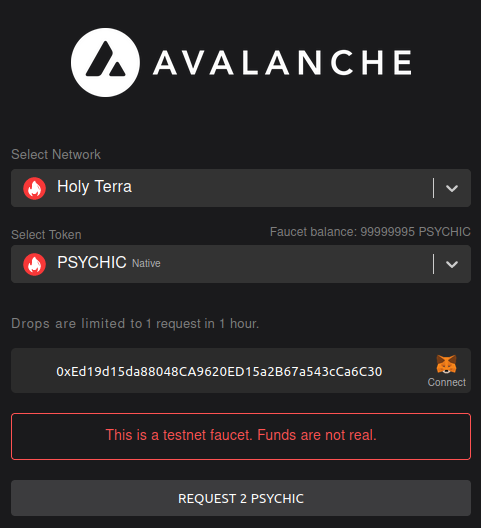
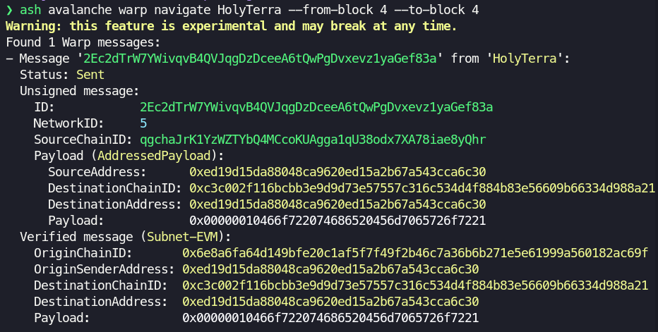

# Avalanche Warp Navigator

<p align=center>

</p>

> A **Navigator** is a \[...\] Human mutant who possesses the Navigator Gene. This gives a Navigator the unique ability to navigate a faster-than-light starship accurately through \[[the Warp](https://warhammer40k.fandom.com/wiki/Immaterium)\]. - [Warhammer 40k Wiki](https://warhammer40k.fandom.com/wiki/Navigator)

Avalanche Warp Navigator is an **experimental feature** of the [Ash Rust CLI](https://github.com/AshAvalanche/ash-rs/tree/v0.3.0-alpha/crates/ash_cli) that allows to **monitor/decode all the messages sent through [Avalanche Warp Messaging](https://docs.avax.network/learn/avalanche/awm)** between [Avalanche](https://www.avax.network/) [Subnet-EVM](https://github.com/ava-labs/subnet-evm) chains.

This project was created during [Avalanche Hackathon 2023 (HK)](https://www.talentre.academy/hackathon/avalanche-hackathon) on 2023-08-07 and is competing in the **Track 3: Dev Tooling**.

The repository contains all the resources required to:

- Interact with the [**HolyTerra EVM chain**](https://explorer.holyterra.ash-test.center/) deployed on Fuji to **send Warp messages** and use **Avalanche Warp Navigator to monitor/decode** them!
- Or setup a **local environment with a Warp enabled Subnet** to run Avalanche Warp Navigator!

**Table of Contents**

- [Use Avalanche Warp Navigator on HolyTerra (Fuji)](#use-avalanche-warp-navigator-on-holyterra-fuji)
  - [Prerequisites](#prerequisites)
  - [Warpspace Subnet information](#warpspace-subnet-information)
  - [Create a wallet and airdrop PSYCHIC tokens](#create-a-wallet-and-airdrop-psychic-tokens)
  - [Send Warp messages from HolyTerra](#send-warp-messages-from-holyterra)
  - [Monitor/decode Warp messages from HolyTerra](#monitordecode-warp-messages-from-holyterra)
- [Use Avalanche Warp Navigator locally](#use-avalanche-warp-navigator-locally)
  - [Prerequisites](#prerequisites-1)
  - [Local environment architecture](#local-environment-architecture)
  - [Environment setup](#environment-setup)
  - [Interact with Avalanche Warp Messaging](#interact-with-avalanche-warp-messaging)
- [Avalanche Warp Messages format](#avalanche-warp-messages-format)
- [Repository content](#repository-content)

## Use Avalanche Warp Navigator on HolyTerra (Fuji)

### Prerequisites

To use Avalanche Warp Navigator on HolyTerra you need to install [Ash CLI](https://github.com/AshAvalanche/ash-rs/tree/v0.3.0-alpha/crates/ash_cli) in version [`0.3.0-alpha`](https://github.com/AshAvalanche/ash-rs/releases/tag/v0.3.0-alpha) (see [Ash CLI Installation](https://ash.center/docs/toolkit/ash-cli/installation)).

### Warpspace Subnet information

For the purpose of this hackathon, the Ash team deployed the _Warpspace Subnet_ on Fuji with 2 Warp-enabled [Subnet-EVM](https://github.com/ava-labs/subnet-evm) chains: `HolyTerra` (in ref. to [Terra](https://warhammer40k.fandom.com/wiki/Terra)) and `Fenris` (in ref. to [Fenris](https://warhammer40k.fandom.com/wiki/Fenris)). Here is the Subnet information:

```bash
Subnet '27FCSEqR5nE9pu255fqrJZZQDNt5Cg4P2B86ifD97KRunhMgic':
  Type: Permissioned
  Control keys: ["P-fuji1eg9uk9nllt8a26s7ynnxkm32mx6t0pyln9tawg"]
  Threshold:    1
  Blockchains list (2):
  - 'HolyTerra':
    ID:      qgchaJrK1YzWZTYbQ4MCcoKUAgga1qU38odx7XA78iae8yQhr
    VM ID:   jvFWMths2qLjsZgbyEKx82PkQv2YWR4rotjQfxV55vLLogjNA
    VM type: SubnetEVM
    RPC URL: https://validator01.ash-test.center/ext/bc/qgchaJrK1YzWZTYbQ4MCcoKUAgga1qU38odx7XA78iae8yQhr/rpc
  - 'Fenris':
    ID:      2VDAzBtDc2Rgzfm3dfu9bjFrJX2b95zcKwBcN426x3wDTz8JeG
    VM ID:   jvFWMths2qLjsZgbyEKx82PkQv2YWR4rotjQfxV55vLLogjNA
    VM type: SubnetEVM
    RPC URL: https://validator01.ash-test.center/ext/bc/2VDAzBtDc2Rgzfm3dfu9bjFrJX2b95zcKwBcN426x3wDTz8JeG/rpc
  Validators list (5):
  - NodeID-FhFWdWodxktJYq884nrJjWD8faLTk9jmp
  - NodeID-QC741RWyWherFvfXhWfB2KttpJEHKxZDS
  - NodeID-23Rau2xyULqtEmCb3CsQa1WhqYK3zG8Z3
  - NodeID-PXmtxGdX1Aab5Rh1yZbeGbkaTVaqmgQvG
  - NodeID-74aTSN8C4dJj1cgwNoK6jMAt4uNhRWHf7
```

The chains are deployed using a custom build of the Subnet-EVM by the Ash team: [Warp-enabled Subnet-EVM](https://github.com/AshAvalanche/subnet-evm/releases/tag/v0.666.0).

The `HolyTerra` chain has been provided with:

- A [Blockscout](https://www.blockscout.com/) explorer avaiable at https://explorer.holyterra.ash-test.center
- A Faucet available at https://faucet.holyterra.ash-test.center

### Create a wallet and airdrop PSYCHIC tokens

Before sending Warp messages, you need a wallet with PSYCHIC energy (=tokens) on the `HolyTerra` chain:

1. Create a new wallet and get its public EVM address:

```bash
# Use the Ash CLI to create a new wallet
# Save the private key to a local file for later use
ash avalanche wallet generate --json | jq -r '.hex' > .private-key.txt

# Set environment variable for the Ash CLI
export ASH_CONFIG=ash-conf/fuji.yml
export AVALANCHE_NETWORK=fuji
export AVALANCHE_PRIVATE_KEY=$(cat .private-key.txt)

# Get the public EVM address of the wallet
ash avalanche wallet info -e hex
# Wallet information:
#   X-Chain address: X-fuji10448z83ddzpua8vyst3fvtemwnn2lgxeuu0z7h
#   P-Chain address: P-fuji10448z83ddzpua8vyst3fvtemwnn2lgxeuu0z7h
#   EVM address:     0xEd19d15da88048CA9620ED15a2B67a543cCa6C30    <-- This address
```

2. Claim some PSYCHIC tokens from the faucet
   1. Go to https://faucet.holyterra.ash-test.center
   2. Paste the EVM address of your wallet
   3. Click on `REQUEST 2 PSYCHIC`:  
      
   4. Check that the transaction was successful on the explorer

### Send Warp messages from HolyTerra

To send Warp messages, we interacting directly with the `WarpMessenger` stateful precompile using [Hardhat](https://hardhat.org/) tasks on the `holyTerra` network:

```bash
# Clone the repo
git clone https://github.com/AshAvalanche/avalanche-warp-navigator.git --recurse-submodules

cd avalanche-warp-navigator/contracts
# Install dependencies
npm install

# Get the bytes32 blockchain ID of the Subnet as seen by WarpMessenger
npx hardhat warpMessenger:getBlockchainID --network holyTerra

# Send a Warp message to your address on the 'Fenris' chain
npx hardhat warpMessenger:sendWarpMessage \
  --destinationchainid 0xc3c002f116bcbb3e9d9d73e57557c316c534d4f884b83e56609b66334d988a21 \
  --destinationaddress 0xEd19d15da88048CA9620ED15a2B67a543cCa6C30 \
  --message 'For the Emperor!' --network holyTerra
```

> **Note:** `AVALANCHE_PRIVATE_KEY` has to be set (see [previous section](#create-a-wallet-and-airdrop-psychic-tokens)).

### Monitor/decode Warp messages from HolyTerra

Now that we have sent a message, we can use `avalanche warp navigate` to decode it!

```bash
# Get all the Warp messages sent from the 'HolyTerra' chain since block 0
ash avalanche warp navigate HolyTerra

# If you want to only see the message you sent, you can use the `--from-block` and `--to-block` options and use the block number of the transaction
ash avalanche warp navigate HolyTerra --from-block 4 --to-block 4
```



Here is your message with its decoded payloads! :tada:

To learn more about the Warp message format, see [Avalanche Warp messages format](#avalanche-warp-messages-format).

## Use Avalanche Warp Navigator locally

### Prerequisites

To use Avalanche Warp Navigator locally you need to install:

- [Multipass](https://multipass.run/) (see [Install Multipass](https://multipass.run/install))
- [Terraform](https://www.terraform.io/) (see [Install Terraform](https://developer.hashicorp.com/terraform/tutorials/aws-get-started/install-cli))
- [jq](https://stedolan.github.io/jq/) (see [Download jq](https://stedolan.github.io/jq/download/))
- [Ash CLI](https://github.com/AshAvalanche/ash-rs/tree/v0.3.0-alpha/crates/ash_cli) in version [`0.3.0-alpha`](https://github.com/AshAvalanche/ash-rs/releases/tag/v0.3.0-alpha) (see [Ash CLI Installation](https://ash.center/docs/toolkit/ash-cli/installation))

### Local environment architecture

The local environment is composed of:

- 5 Avalanche nodes running on Multipass VMs (deployed using [ansible-avalanche-getting-started](https://github.com/AshAvalanche/ansible-avalanche-getting-started))
- 1 Blockscout explorer running on a Multipass VM
- 1 Subnet with 2 EVM chains: `HolyTerra` and `Fenris`

The chains are deployed using a custom build of the Subnet-EVM by the Ash team: [Warp-enabled Subnet-EVM](https://github.com/AshAvalanche/subnet-evm/releases/tag/v0.666.0).

### Environment setup

#### Bootstrap the local network

Run `scripts/local_network.sh` to bootstrap a local Avalanche test network with 5 nodes and create a Subnet with 2 EVM chains:

```bash
# Clone the repo
git clone https://github.com/AshAvalanche/avalanche-warp-navigator.git --recurse-submodules

cd avalanche-warp-navigator
./scripts/local_network.sh
```

Run `scripts/explorer.sh` to deploy the Blockscout explorer:

```bash
./scripts/explorer.sh
```

##### Environment cleanup

Run `scripts/cleanup.sh` to destroy the local network and the Blockscout explorer.

```bash
./scripts/cleanup.sh
```

### Interact with Avalanche Warp Messaging

#### Send Warp messages

See [Sending Warp messages from HolyTerra](#sending-warp-messages-from-holyterra) for instructions on how to send Warp messages from the `HolyTerra` chain. Replace the `--network` option with `local` to target the local Avalanche network.

#### Monitor/decode Warp messages

1. Set environment variables for the Ash CLI:
   ```bash
   export ASH_CONFIG=ash-conf/local.yml
   export AVALANCHE_NETWORK=local
   ```
2. See [Monitor/decode Warp messages from HolyTerra](#monitordecode-warp-messages-from-holyterra) for instructions on how to monitor/decode Warp messages from the `HolyTerra` chain.

## Avalanche Warp Messages format

Let's explain the different parts of a Warp message with the example of the message sent from `HolyTerra` to `Fenris`:


- `Status`: the message status. It can be `Sent` or `Signed by X validators`. This is computed by the Ash CLI by querying each validator for its signature of the message.
  > **Note:** the Ash CLI might not be able to query the validators on Fuji. In this case, the status will be `Sent` even if the message has technically been signed by the validators.
- `Unsigned message` ([UnsignedMessage](https://github.com/ava-labs/avalanchego/blob/master/vms/platformvm/warp/unsigned_message.go#L14)): all the bytes of the message except the signature and the ID
  - `ID`: the ID of the message. It is actually a SHA256 hash of the unsigned message.
  - `NetworkID`: the ID of the Avalanche network the message is sent from (e.g. `5` for Fuji)
  - `SourceChainID`: the CB58 ID of the chain the message is sent from (e.g. `qgchaJrK1YzWZTYbQ4MCcoKUAgga1qU38odx7XA78iae8yQhr` for `HolyTerra`)
  - `Payload`: the message payload as arbitrary bytes. In our case, it is an [AddressedPayload](https://github.com/ava-labs/subnet-evm/blob/master/warp/payload/payload.go#L14) of the Subnet-EVM.
- `Verified message`: the message as it will be consumed on a destination chain. In our case it is the Subnet-EVM [WarpMessage](https://github.com/ava-labs/subnet-evm/blob/c56d42d51da4d5423aa192d99e33a85c2b82747d/x/warp/contract.go#L57) that will be outputed by the `getVerifiedMessage` precompile function.

For more information of how messages are generated, signed and reveived, see [subnet-evm Avalanche Warp Messaging README](https://github.com/ava-labs/subnet-evm/blob/master/x/warp/README.md).

## Repository content

- `ansible-avalanche-getting-started/`: Ansible playbook to bootstrap a local Avalanche test network with 5 nodes (Git submodule)
- `ash-conf/`: Ash CLI configuration files for the local (autogenerated) and Fuji networks
- `contracts/`: Solidity contracts to interact with stateful precompiles taken from [subnet-evm/contracts](https://github.com/ava-labs/subnet-evm/tree/master/contracts).
- `scripts/`: Bash scripts to bootstrap/cleanup the local network and deploy the Blockscout explorer
