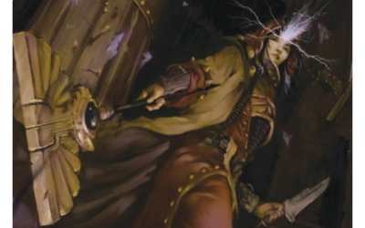
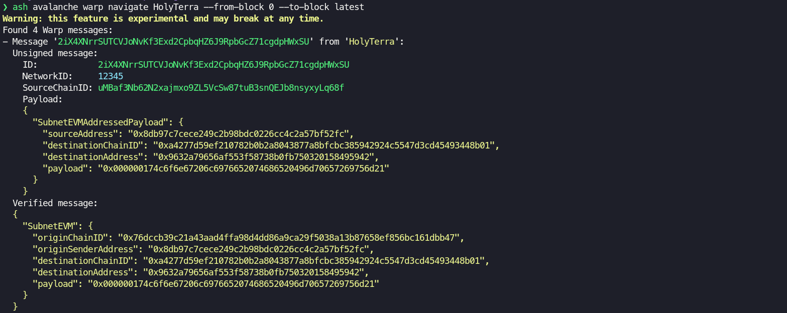

# Avalanche Warp Navigator

<p align=center>

</p>

> A **Navigator** is a \[...\] Human mutant who possesses the Navigator Gene. This gives a Navigator the unique ability to navigate a faster-than-light starship accurately through \[[the Warp](https://warhammer40k.fandom.com/wiki/Immaterium)\]. - [Warhammer 40k Wiki](https://warhammer40k.fandom.com/wiki/Navigator)

This repository contains all the resources required to setup an local environment to run Avalanche Warp Navigator.

Avalanche Warp Navigator is an **experimental feature** of the [Ash Rust SDK](https://github.com/AshAvalanche/ash-rs) that allows to **monitor all the messages sent through [Avalanche Warp Messaging](https://docs.avax.network/learn/avalanche/awm)** between [Avalanche](https://www.avax.network/) [Subnet-EVM](https://github.com/ava-labs/subnet-evm) chains.

This project was created during [Avalanche Hackathon 2023 (HK)](https://www.talentre.academy/hackathon/avalanche-hackathon) on 2023-08-07 and is competing in the **Track 3: Dev Tooling**.

## Prerequisites

To try out Avalanche Warp Navigator you need to have the following software installed on your machine:

- [Multipass](https://multipass.run/) (see [Install Multipass](https://multipass.run/install))
- [Terraform](https://www.terraform.io/) (see [Install Terraform](https://developer.hashicorp.com/terraform/tutorials/aws-get-started/install-cli))
- [jq](https://stedolan.github.io/jq/) (see [Download jq](https://stedolan.github.io/jq/download/))
- [Ash CLI](https://github.com/AshAvalanche/ash-rs/tree/main/crates/ash_cli) in version [`0.3.0-alpha`](https://github.com/AshAvalanche/ash-rs/releases/tag/v0.3.0-alpha) (see [Ash CLI Installation](https://ash.center/docs/toolkit/ash-cli/installation))

## Useful information

The local environment is composed of:

- 5 Avalanche nodes running on Multipass VMs
- 1 Blockscout explorer running on a Multipass VM
- 1 Subnet with 2 EVM chains: `HolyTerra` and `Fenris`

The EVM chains are deployed using a custom build of the Subnet-EVM by the Ash team: [Warp-enabled Subnet-EVM](https://github.com/AshAvalanche/subnet-evm/releases/tag/v0.666.0)

## Environment setup

First of all, clone this repo:

```bash
git clone https://github.com/AshAvalanche/avalanche-warp-navigator.git --recurse-submodules
```

### Local network bootstrap

Run `scripts/local_network.sh` to bootstrap a local Avalanche test network with 5 nodes and create a Subnet with 2 EVM chains:

```bash
cd avalanche-warp-navigator
./scripts/local_network.sh
```

Run `scripts/explorer.sh` to deploy a Blockscout explorer:

```bash
./scripts/explorer.sh
```

### Environment cleanup

Run `scripts/cleanup.sh` to destroy the local network and the Blockscout explorer.

```bash
./scripts/cleanup.sh
```

## Interaction with Avalanche Warp Messaging

### Sending Warp messages

Contracts under `contracts/` are taken from [subnet-evm/contracts](https://github.com/ava-labs/subnet-evm/tree/master/contracts).

We can send Warp messages by interacting with the `WarpMessenger` stateful precompiles using Hardhat tasks on the `local` network:

```bash
# Populate environment variables from the repository root
source scripts/env_vars.sh

cd contracts
# Install dependencies
npm install

# Get the bytes32 blockchain ID of the Subnet as seen by WarpMessenger
npx hardhat warpMessenger:getBlockchainID --network local

# Send a Warp message
npx hardhat warpMessenger:sendWarpMessage \
  --destinationchainid 0xa4277d59ef210782b0b2a8043877a8bfcbc385942924c5547d3cd45493448b01 \
  --destinationaddress 0x9632a79656af553F58738B0FB750320158495942 \
  --message 'For the Emperor!' --network local
```

### Monitoring Warp messages

Use the `avalanche warp navigate` command of the Ash CLI to monitor Warp messages:

```bash
# Set the Ash environment variables
export ASH_CONFIG=conf/local.yml
export AVALANCHE_NETWORK=local
# Get all the Warp messages sent from the 'HolyTerra' chain betwwen block 0 and the latest block
ash avalanche warp navigate HolyTerra --from-block 0 --to-block latest
```



## Decoding Avalanche Warp messages

The bytes of a Subnet-EVM Warp message are composed of:

```python
'0000'     # 2B: CodecVersion?
'00003039' # 4B: NetworkID
'76dccb39c21a43aad4ffa98d4dd86a9ca29f5038a13b87658ef856bc161dbb47' # 32B: SourceChainID
# AddressesPayload
'00000062'     # 4B: AddressedPayload length
'000000000000' # 6B: ???
'8db97c7cece249c2b98bdc0226cc4c2a57bf52fc'                         # 20B: SourceAddress
'a4277d59ef210782b0b2a8043877a8bfcbc385942924c5547d3cd45493448b01' # 32B: DestinationChainID
'9632a79656af553f58738b0fb750320158495942'                         # 20B: DestinationAddress
'00000010466f722074686520456d7065726f7221'                         # XXB: Payload (ABI encoded)
```
